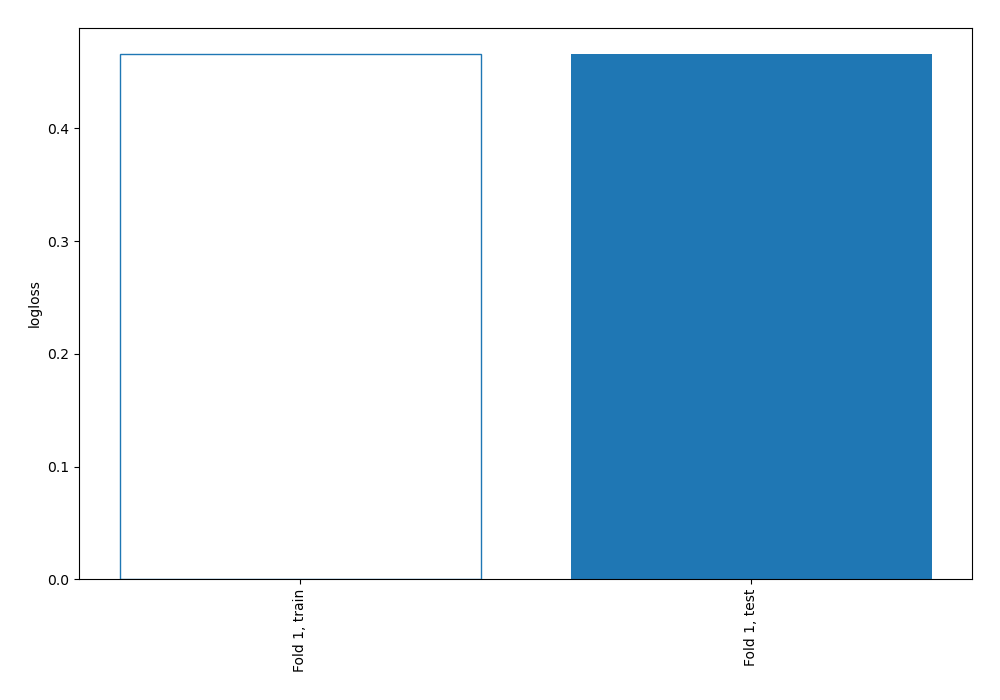
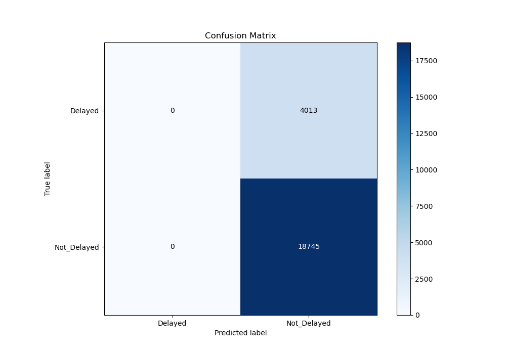
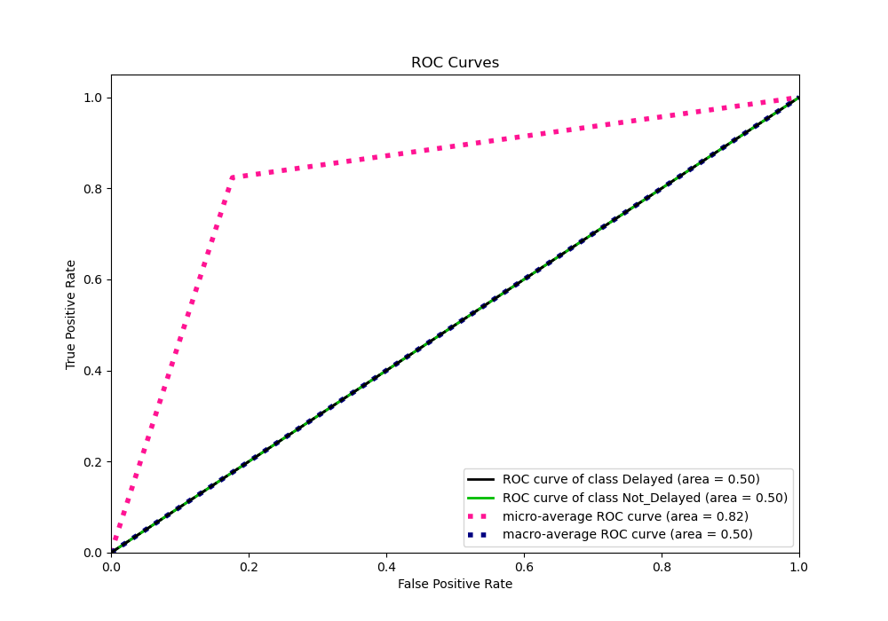
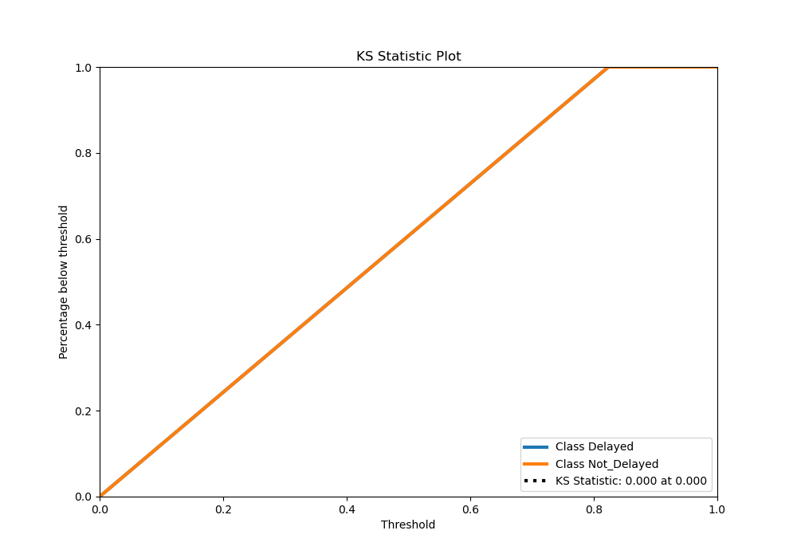
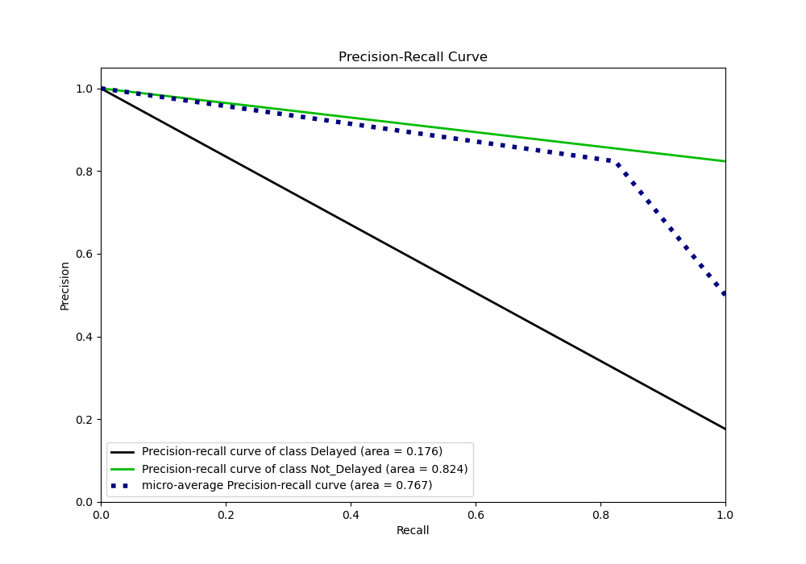
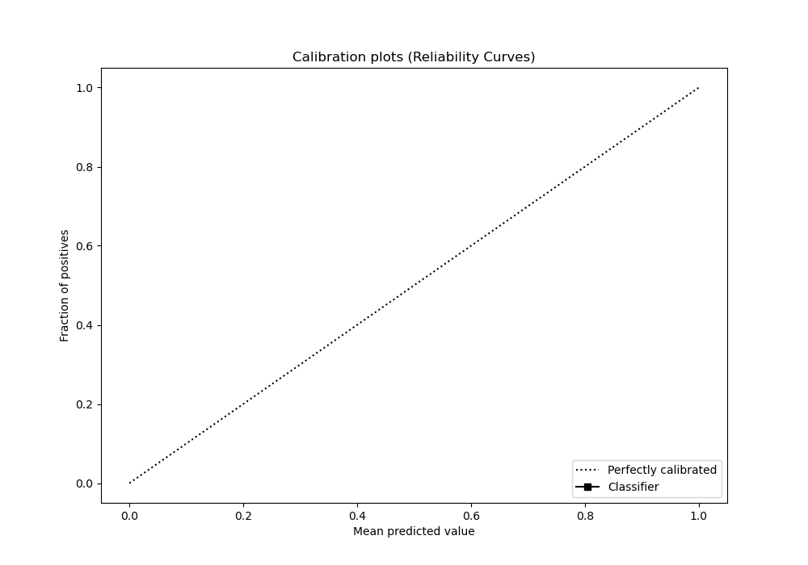
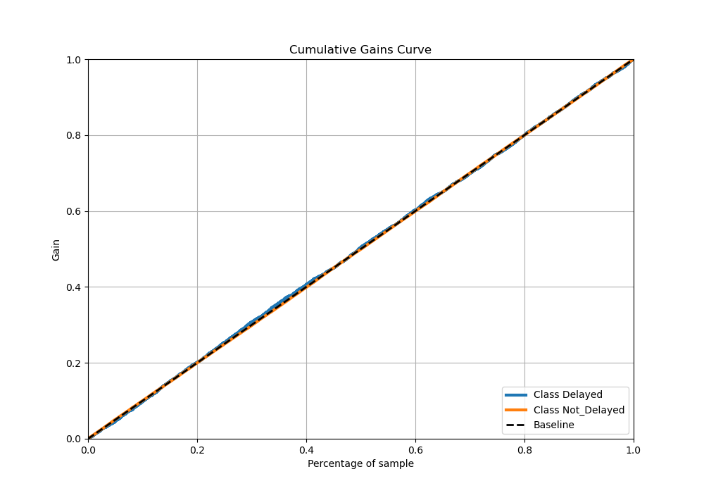

# Summary of 1_Baseline

[<< Go back](../README.md)

## Baseline Classifier (Baseline)
- **n_jobs**: -1
- **explain_level**: 2

## Validation
 - **validation_type**: split
 - **train_ratio**: 0.75
 - **shuffle**: True
 - **stratify**: True

## Optimized metric
logloss

## Training time

0.7 seconds

## Metric details
|           |    score |   threshold |
|:----------|---------:|------------:|
| logloss   | 0.465788 |   nan       |
| auc       | 0.5      |   nan       |
| f1        | 0.903308 |     0.74128 |
| accuracy  | 0.823666 |     0.74128 |
| precision | 0.823666 |     0.74128 |
| recall    | 1        |     0.74128 |
| mcc       | 0        |     0.74128 |

## Metric details with threshold from accuracy metric
|           |    score |   threshold |
|:----------|---------:|------------:|
| logloss   | 0.465788 |   nan       |
| auc       | 0.5      |   nan       |
| f1        | 0.903308 |     0.74128 |
| accuracy  | 0.823666 |     0.74128 |
| precision | 0.823666 |     0.74128 |
| recall    | 1        |     0.74128 |
| mcc       | 0        |     0.74128 |

## Confusion matrix (at threshold=0.74128)
|                        |   Predicted as Delayed |   Predicted as Not_Delayed |
|:-----------------------|-----------------------:|---------------------------:|
| Labeled as Delayed     |                      0 |                       4013 |
| Labeled as Not_Delayed |                      0 |                      18745 |

## Learning curves

## Confusion Matrix

## Normalized Confusion Matrix

## ROC Curve

## Kolmogorov-Smirnov Statistic

## Precision-Recall Curve

## Calibration Curve

## Cumulative Gains Curve

## Lift Curve

[<< Go back](../README.md)
