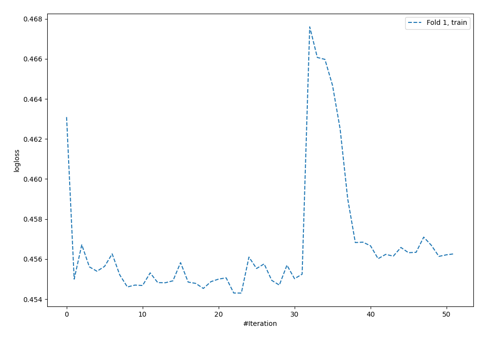
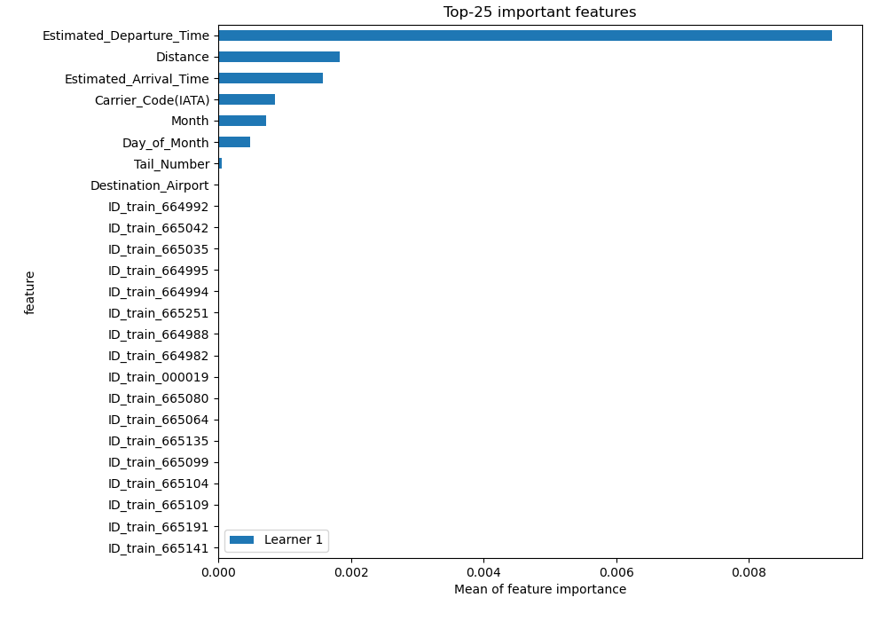
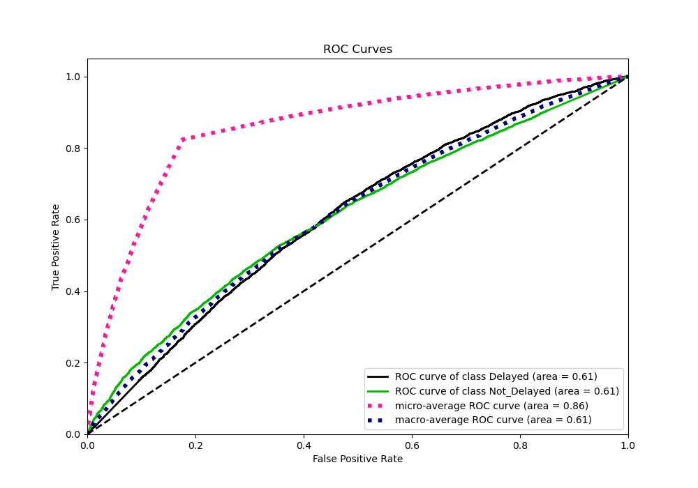
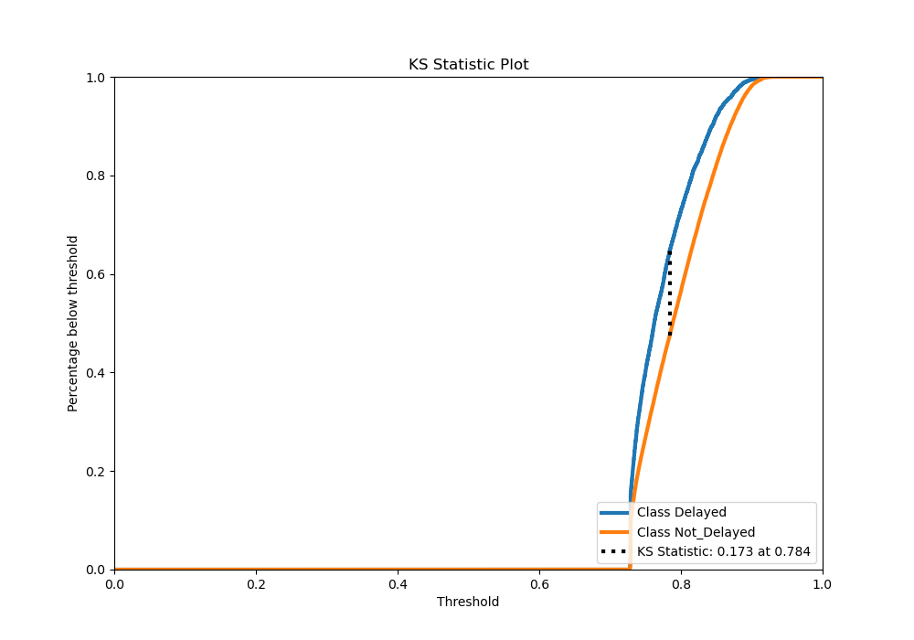
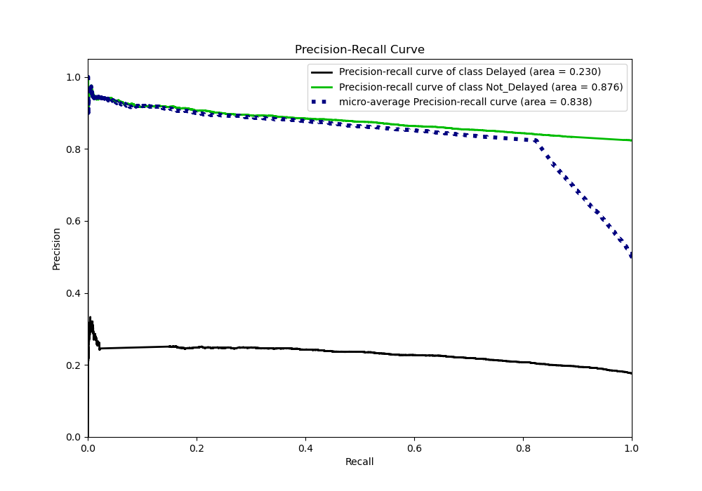
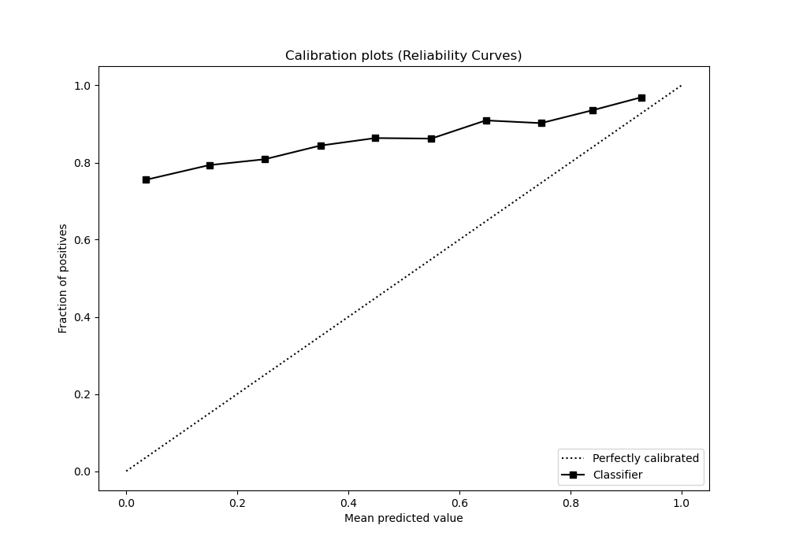
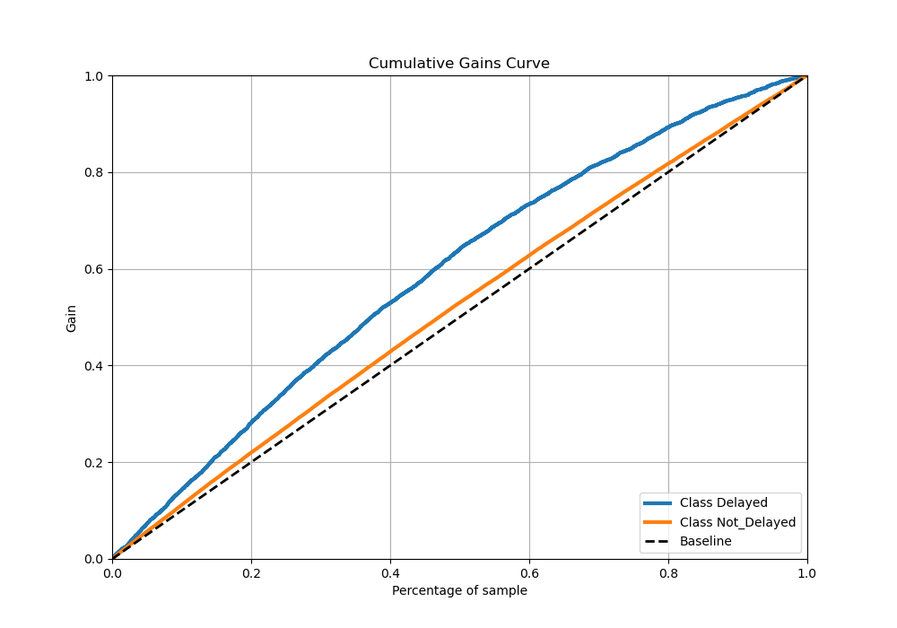
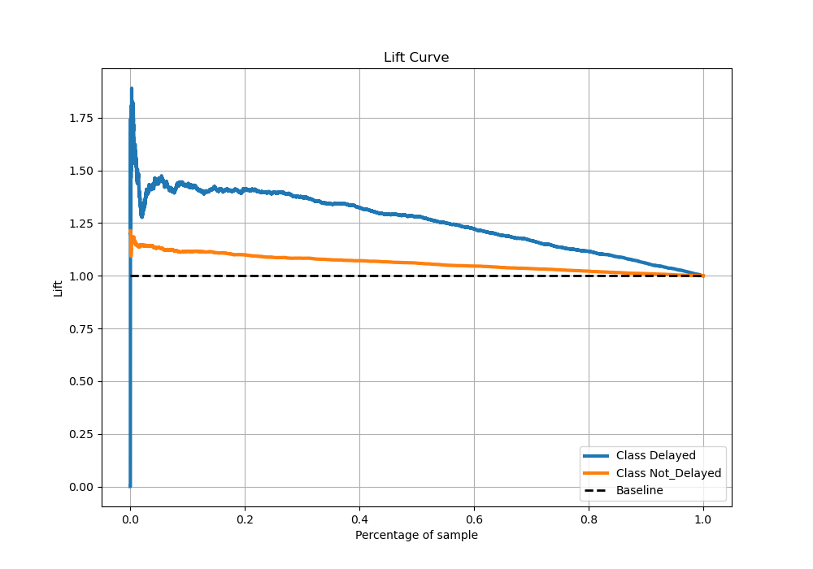

# Summary of 4_Default_NeuralNetwork

[<< Go back](../README.md)

## Neural Network
- **n_jobs**: -1
- **dense_1_size**: 32
- **dense_2_size**: 16
- **learning_rate**: 0.05
- **explain_level**: 2

## Validation
 - **validation_type**: split
 - **train_ratio**: 0.75
 - **shuffle**: True
 - **stratify**: True

## Optimized metric
logloss

## Training time

23.8 seconds

## Metric details
|           |    score |   threshold |
|:----------|---------:|------------:|
| logloss   | 0.458453 |  nan        |
| auc       | 0.609956 |  nan        |
| f1        | 0.903308 |    0.653853 |
| accuracy  | 0.823666 |    0.653853 |
| precision | 0.94188  |    0.89404  |
| recall    | 1        |    0.653853 |
| mcc       | 0.131061 |    0.784664 |

## Metric details with threshold from accuracy metric
|           |    score |   threshold |
|:----------|---------:|------------:|
| logloss   | 0.458453 |  nan        |
| auc       | 0.609956 |  nan        |
| f1        | 0.903308 |    0.653853 |
| accuracy  | 0.823666 |    0.653853 |
| precision | 0.823666 |    0.653853 |
| recall    | 1        |    0.653853 |
| mcc       | 0        |    0.653853 |

## Confusion matrix (at threshold=0.653853)
|                        |   Predicted as Delayed |   Predicted as Not_Delayed |
|:-----------------------|-----------------------:|---------------------------:|
| Labeled as Delayed     |                      0 |                       4013 |
| Labeled as Not_Delayed |                      0 |                      18745 |

## Learning curves

## Permutation-based Importance

## Confusion Matrix

## Normalized Confusion Matrix

## ROC Curve

## Kolmogorov-Smirnov Statistic

## Precision-Recall Curve

## Calibration Curve

## Cumulative Gains Curve

## Lift Curve

[<< Go back](../README.md)
