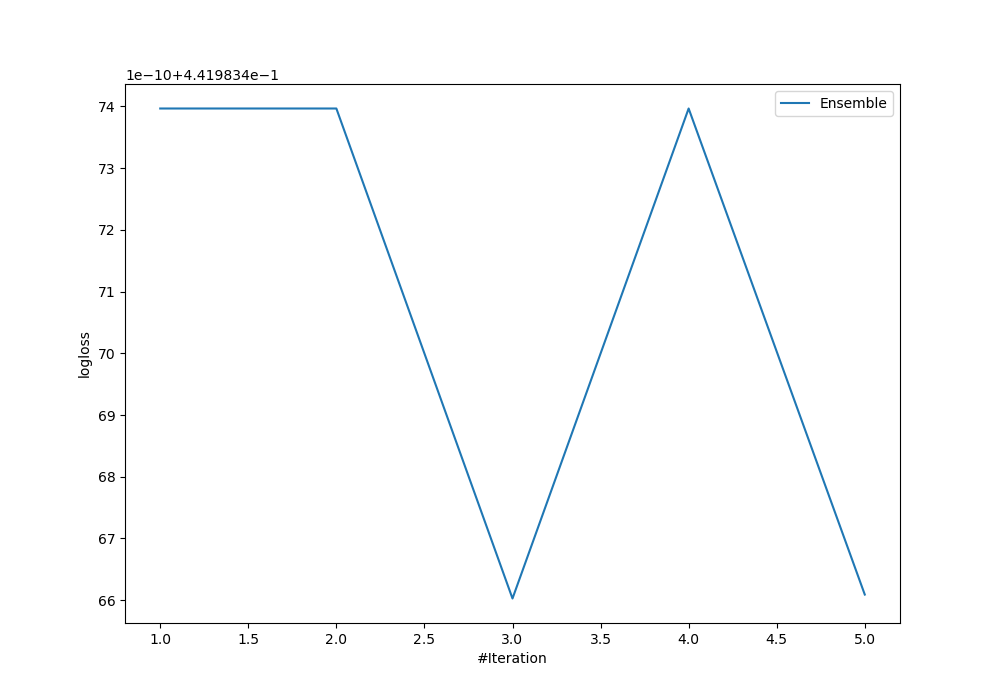
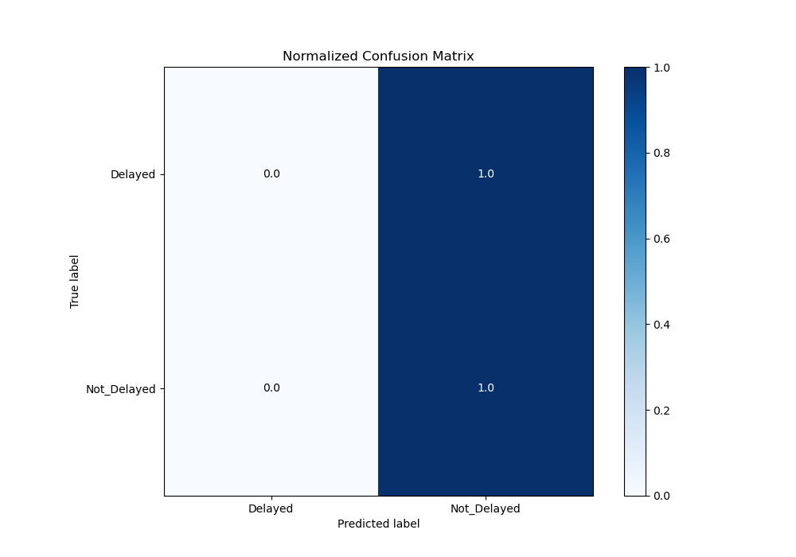
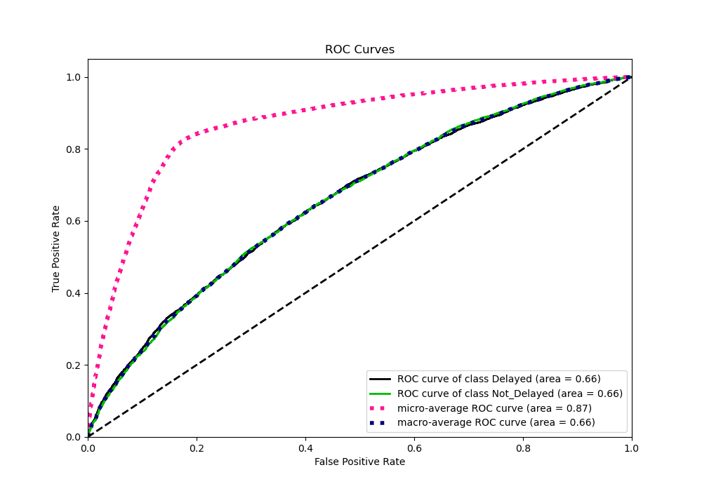
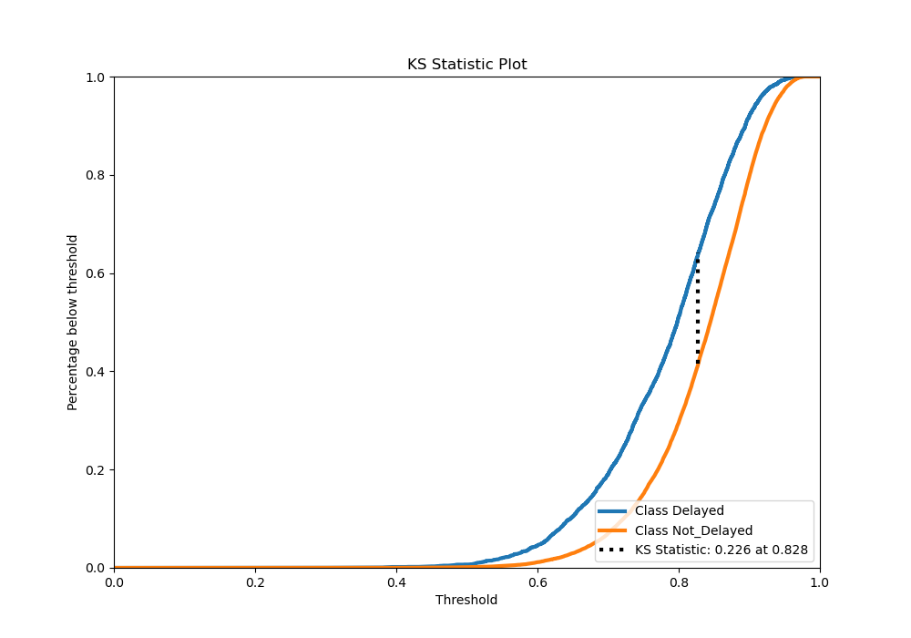
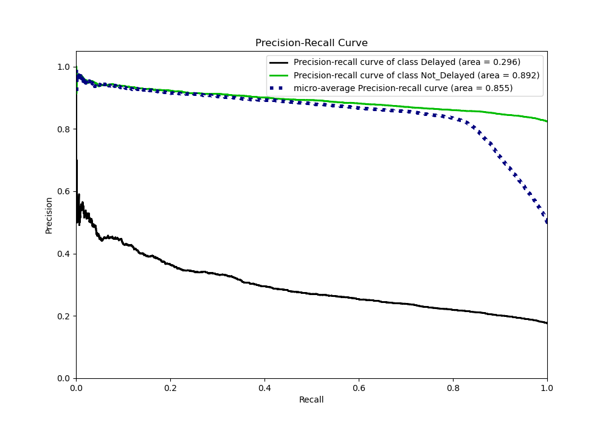
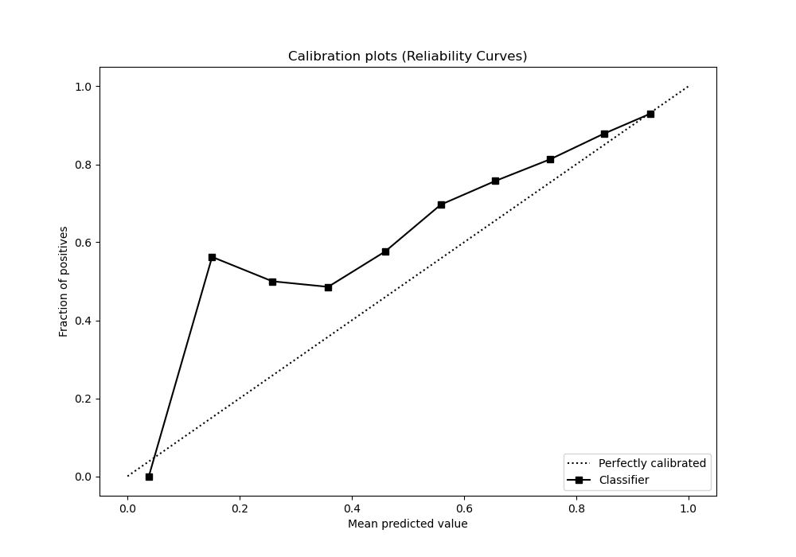
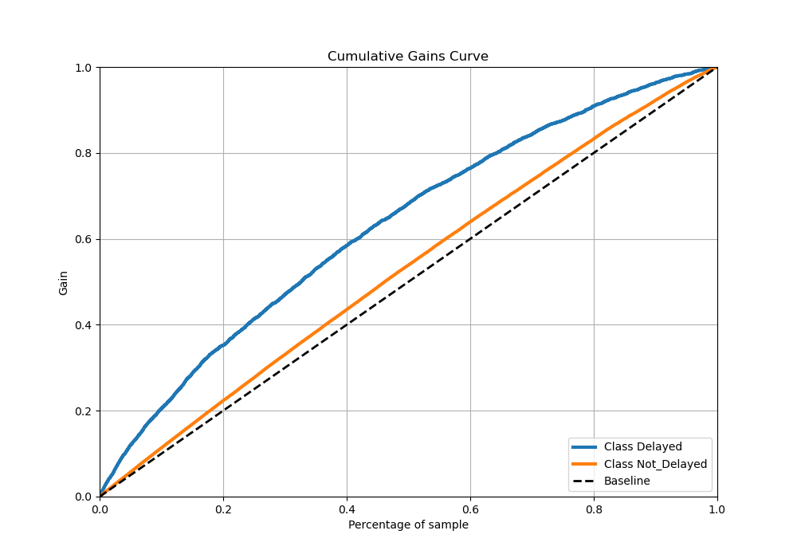
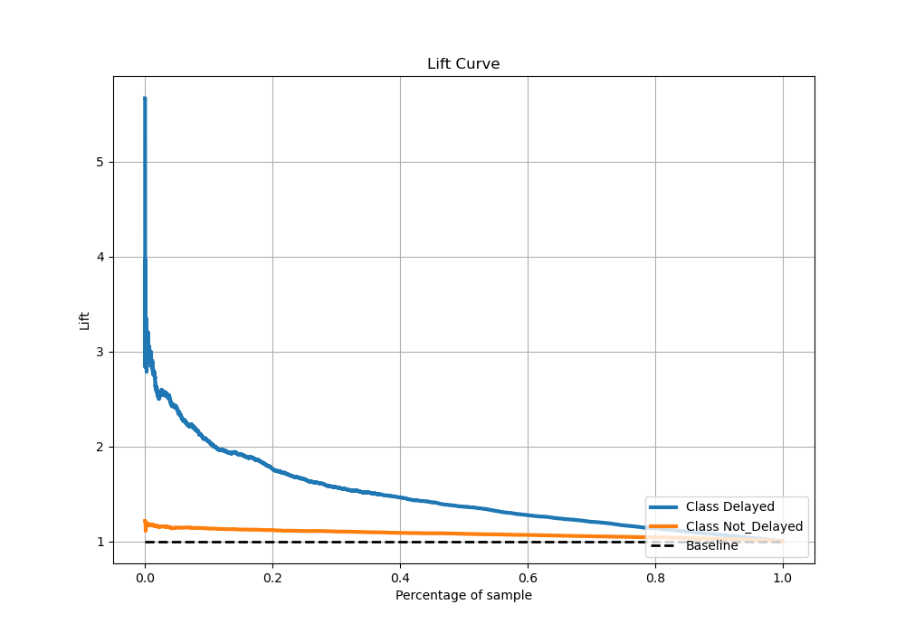

# Summary of Ensemble

[<< Go back](../README.md)

## Ensemble structure
| Model             |   Weight |
|:------------------|---------:|
| 3_Default_Xgboost |        3 |

## Metric details
|           |    score |   threshold |
|:----------|---------:|------------:|
| logloss   | 0.441983 |  nan        |
| auc       | 0.657749 |  nan        |
| f1        | 0.903308 |    0.273332 |
| accuracy  | 0.823666 |    0.273332 |
| precision | 0.950732 |    0.944159 |
| recall    | 1        |    0.273332 |
| mcc       | 0.183115 |    0.748093 |

## Metric details with threshold from accuracy metric
|           |    score |   threshold |
|:----------|---------:|------------:|
| logloss   | 0.441983 |  nan        |
| auc       | 0.657749 |  nan        |
| f1        | 0.903308 |    0.273332 |
| accuracy  | 0.823666 |    0.273332 |
| precision | 0.823666 |    0.273332 |
| recall    | 1        |    0.273332 |
| mcc       | 0        |    0.273332 |

## Confusion matrix (at threshold=0.273332)
|                        |   Predicted as Delayed |   Predicted as Not_Delayed |
|:-----------------------|-----------------------:|---------------------------:|
| Labeled as Delayed     |                      0 |                       4013 |
| Labeled as Not_Delayed |                      0 |                      18745 |

## Learning curves

## Confusion Matrix

## Normalized Confusion Matrix

## ROC Curve

## Kolmogorov-Smirnov Statistic

## Precision-Recall Curve

## Calibration Curve

## Cumulative Gains Curve

## Lift Curve

[<< Go back](../README.md)
