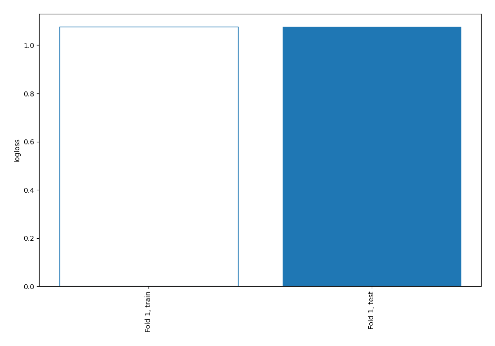
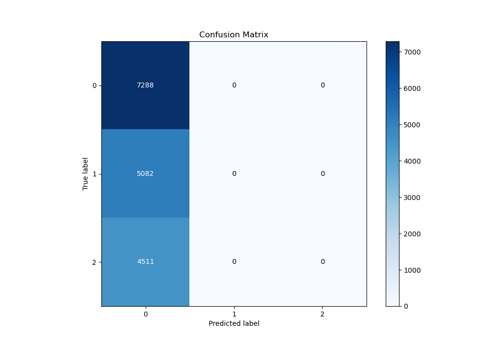
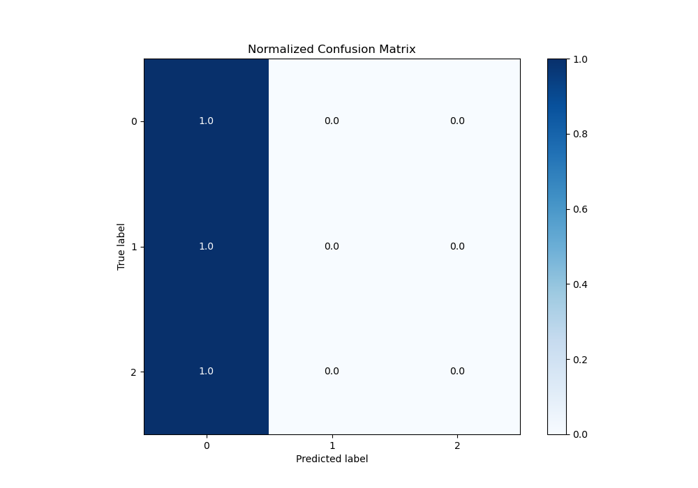
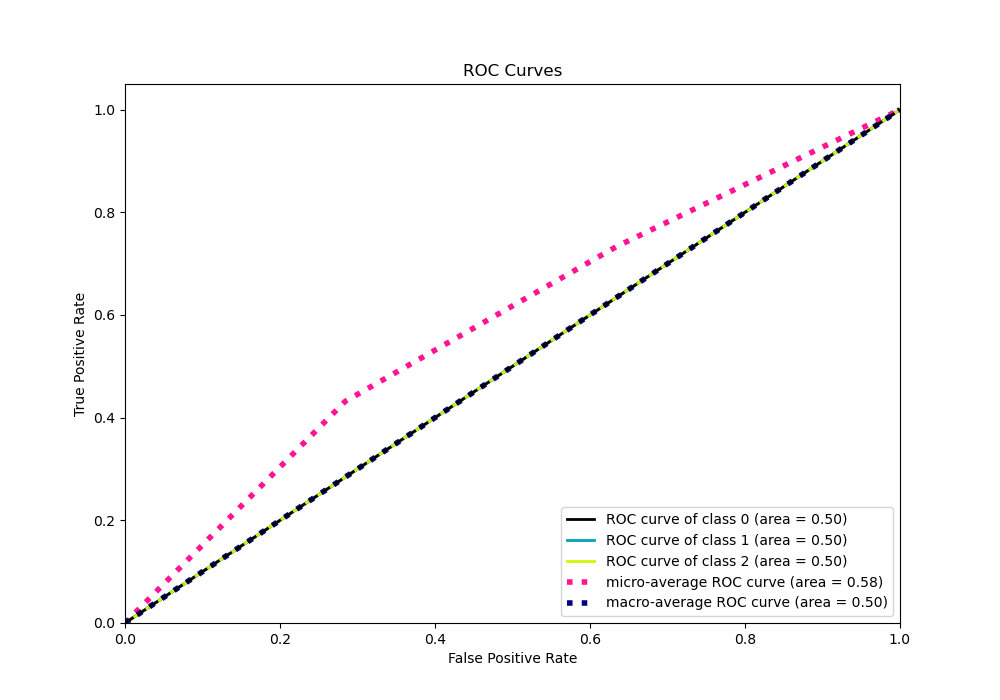
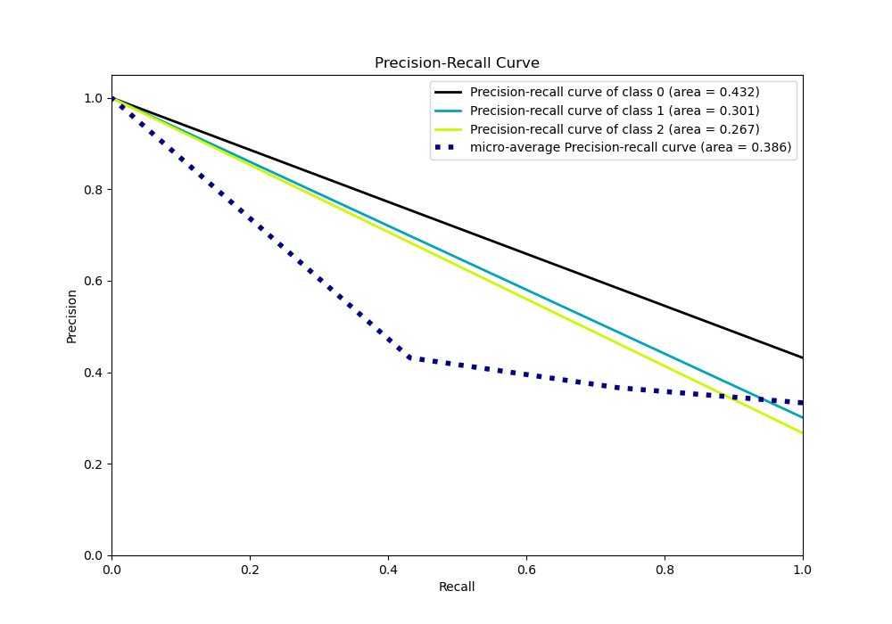

# Summary of 1_Baseline

[<< Go back](../README.md)

## Baseline Classifier (Baseline)
- **n_jobs**: -1
- **num_class**: 3
- **explain_level**: 2

## Validation
 - **validation_type**: split
 - **train_ratio**: 0.75
 - **shuffle**: True
 - **stratify**: True

## Optimized metric
logloss

## Training time

0.9 seconds

### Metric details
|           |           0 |    1 |    2 |   accuracy |    macro avg |   weighted avg |   logloss |
|:----------|------------:|-----:|-----:|-----------:|-------------:|---------------:|----------:|
| precision |    0.431728 |    0 |    0 |   0.431728 |     0.143909 |       0.186389 |   1.07668 |
| recall    |    1        |    0 |    0 |   0.431728 |     0.333333 |       0.431728 |   1.07668 |
| f1-score  |    0.603087 |    0 |    0 |   0.431728 |     0.201029 |       0.260369 |   1.07668 |
| support   | 7288        | 5082 | 4511 |   0.431728 | 16881        |   16881        |   1.07668 |

## Confusion matrix
|              |   Predicted as 0 |   Predicted as 1 |   Predicted as 2 |
|:-------------|-----------------:|-----------------:|-----------------:|
| Labeled as 0 |             7288 |                0 |                0 |
| Labeled as 1 |             5082 |                0 |                0 |
| Labeled as 2 |             4511 |                0 |                0 |

## Learning curves

## Confusion Matrix

## Normalized Confusion Matrix

## ROC Curve

## Precision Recall Curve

[<< Go back](../README.md)
