# Summary of 2_DecisionTree

[<< Go back](../README.md)

## Decision Tree
- **n_jobs**: -1
- **criterion**: gini
- **max_depth**: 3
- **num_class**: 3
- **explain_level**: 2

## Validation
 - **validation_type**: split
 - **train_ratio**: 0.75
 - **shuffle**: True
 - **stratify**: True

## Optimized metric
logloss

## Training time

18.1 seconds

### Metric details
|           |           0 |           1 |           2 |   accuracy |    macro avg |   weighted avg |   logloss |
|:----------|------------:|------------:|------------:|-----------:|-------------:|---------------:|----------:|
| precision |    0.552507 |    0.530215 |    0.454382 |   0.528049 |     0.512368 |       0.519575 |  0.992267 |
| recall    |    0.737788 |    0.397088 |    0.336732 |   0.528049 |     0.490536 |       0.528049 |  0.992267 |
| f1-score  |    0.631845 |    0.454095 |    0.386809 |   0.528049 |     0.490917 |       0.512854 |  0.992267 |
| support   | 7288        | 5082        | 4511        |   0.528049 | 16881        |   16881        |  0.992267 |

## Confusion matrix
|              |   Predicted as 0 |   Predicted as 1 |   Predicted as 2 |
|:-------------|-----------------:|-----------------:|-----------------:|
| Labeled as 0 |             5377 |              856 |             1055 |
| Labeled as 1 |             2295 |             2018 |              769 |
| Labeled as 2 |             2060 |              932 |             1519 |

## Learning curves

## Permutation-based Importance
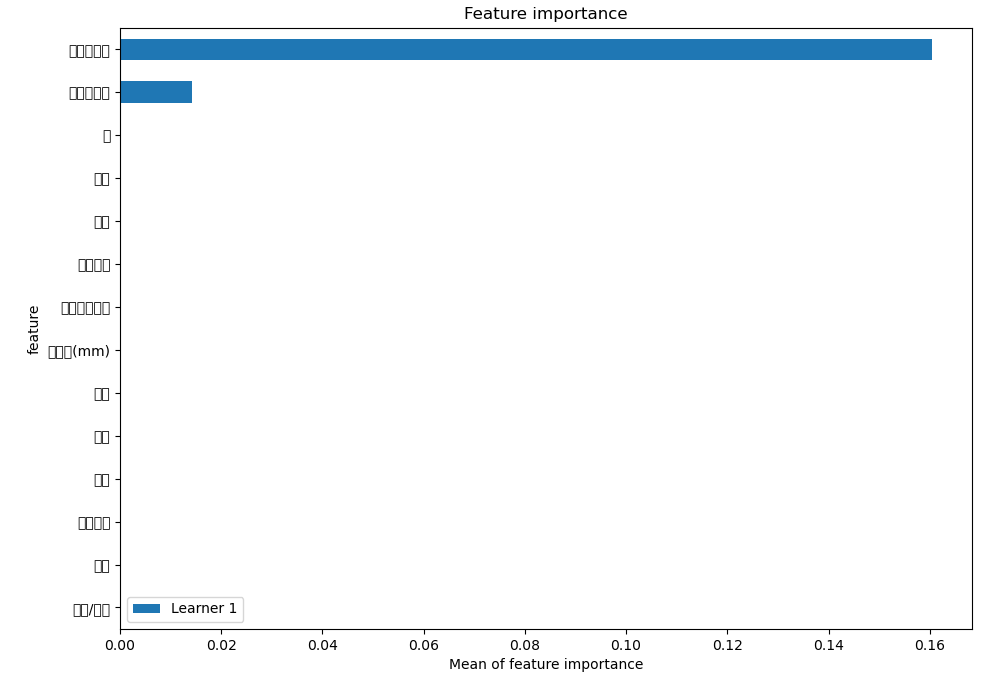
## Confusion Matrix

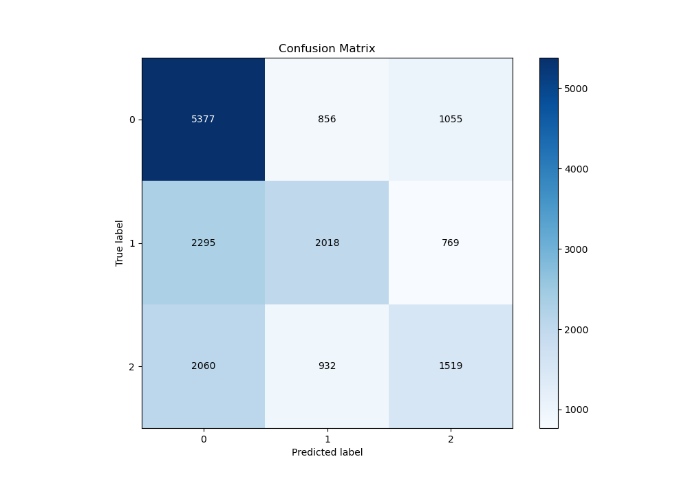

## Normalized Confusion Matrix

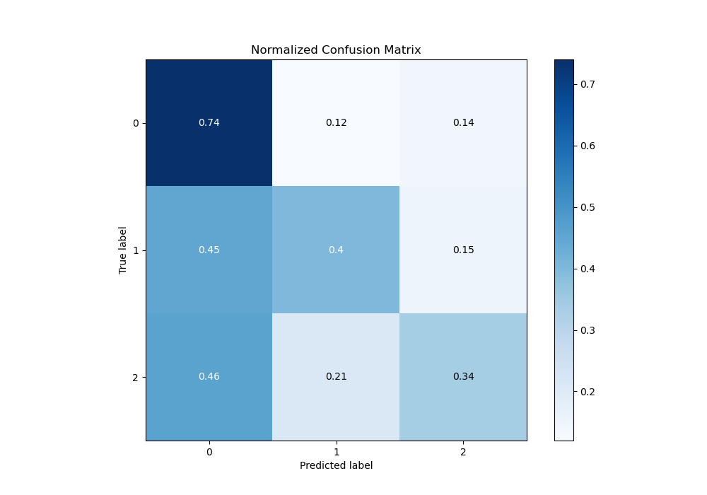

## ROC Curve

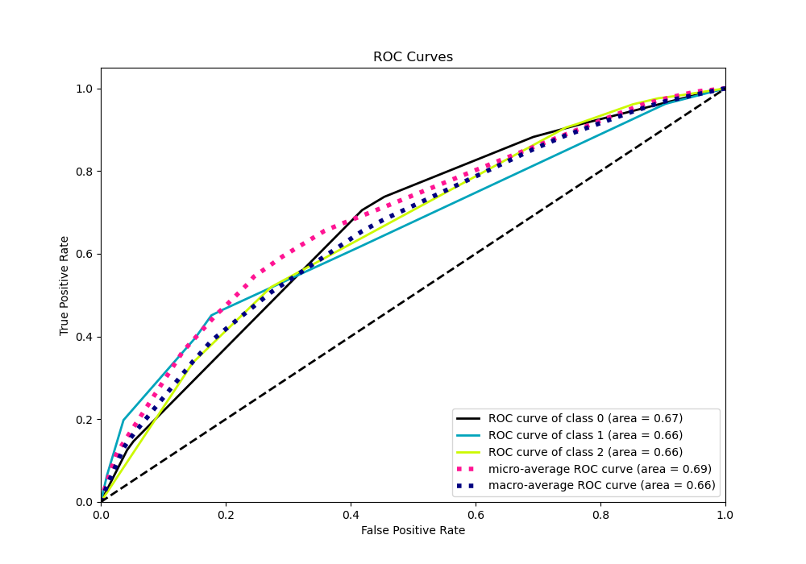

## Precision Recall Curve

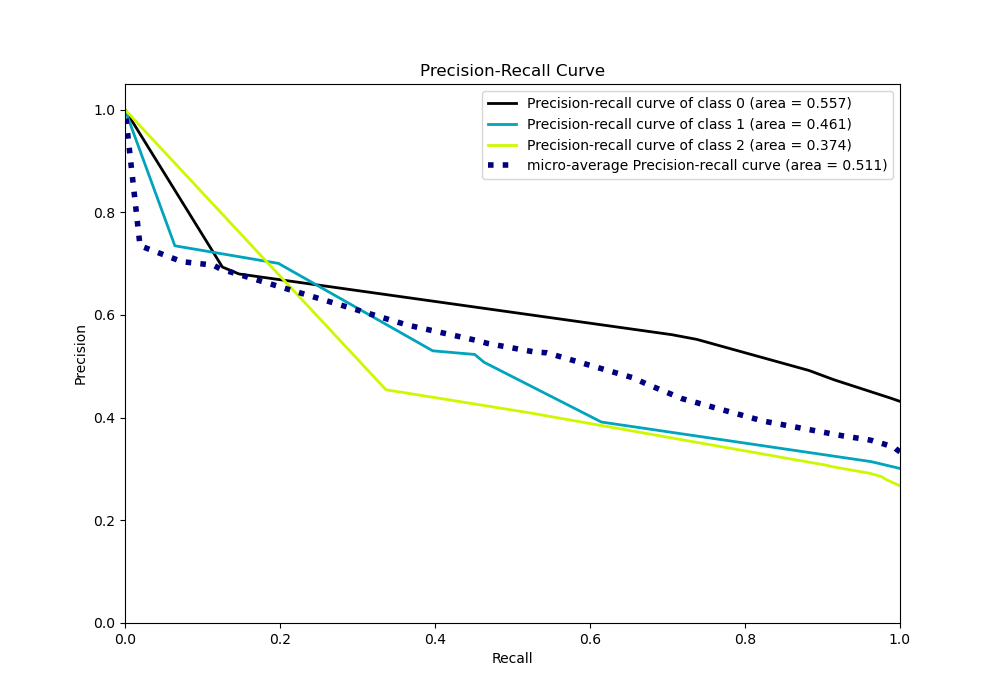

## SHAP Importance
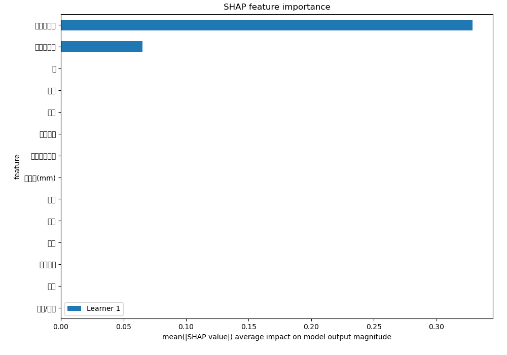

## SHAP Dependence plots

### Dependence 0 (Fold 1)
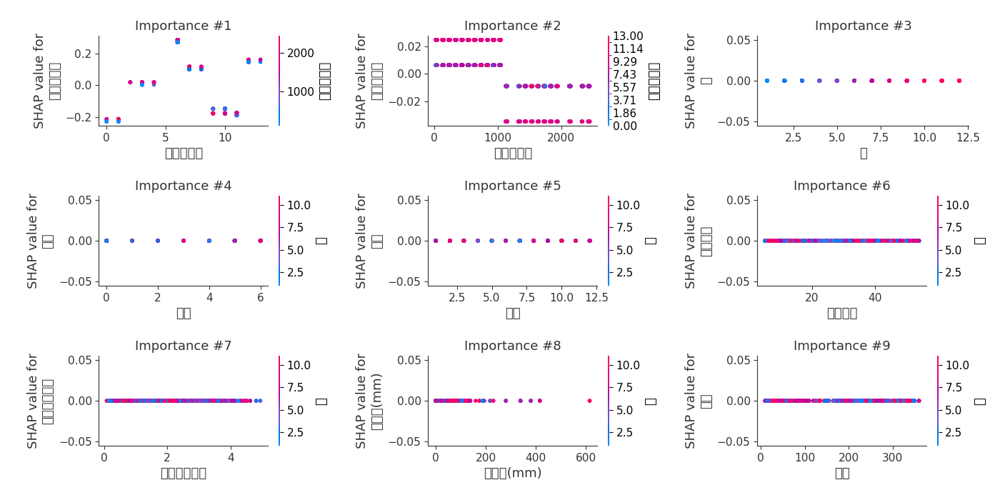
### Dependence 1 (Fold 1)
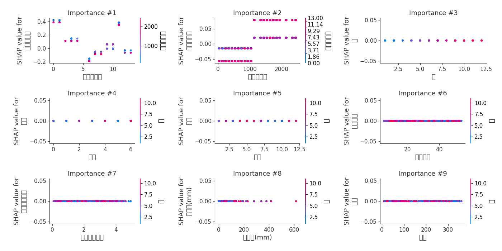
### Dependence 2 (Fold 1)
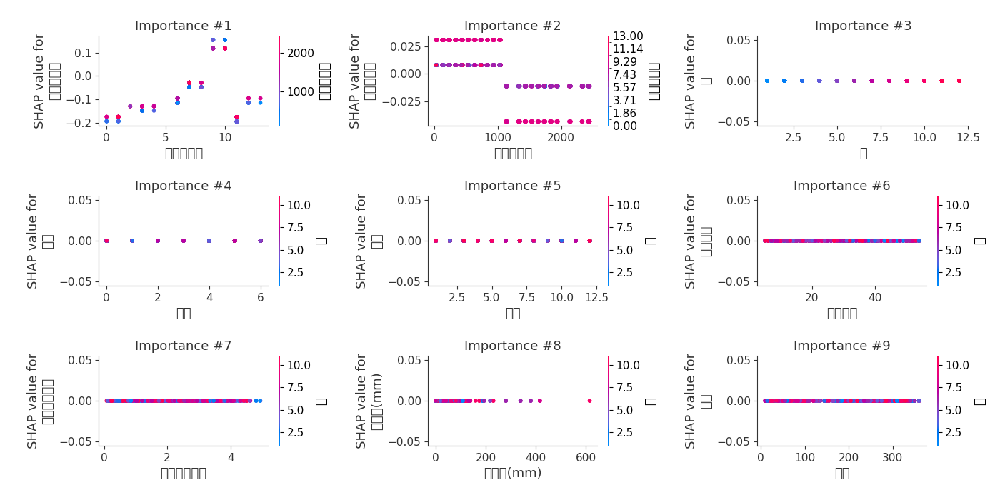

## SHAP Decision plots

### Worst decisions for selected sample 1 (Fold 1)
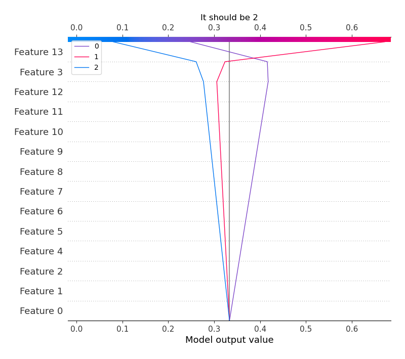
### Worst decisions for selected sample 2 (Fold 1)

### Worst decisions for selected sample 3 (Fold 1)
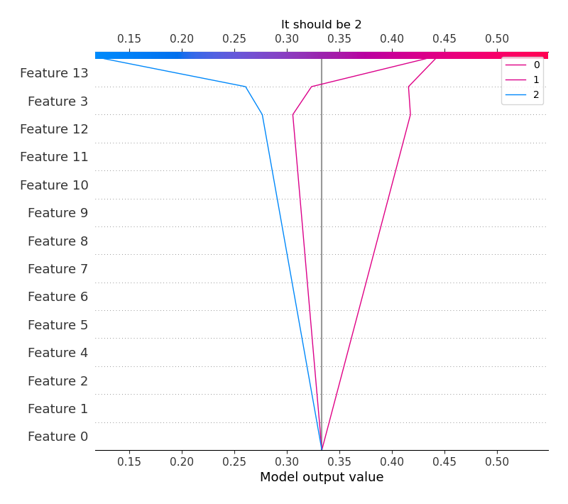
### Worst decisions for selected sample 4 (Fold 1)
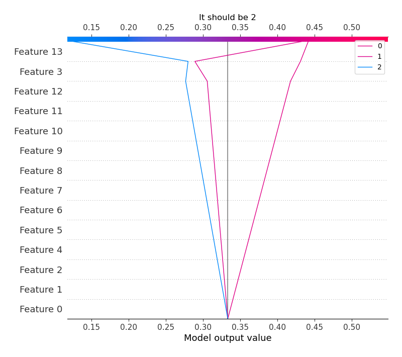
### Best decisions for selected sample 1 (Fold 1)

### Best decisions for selected sample 2 (Fold 1)
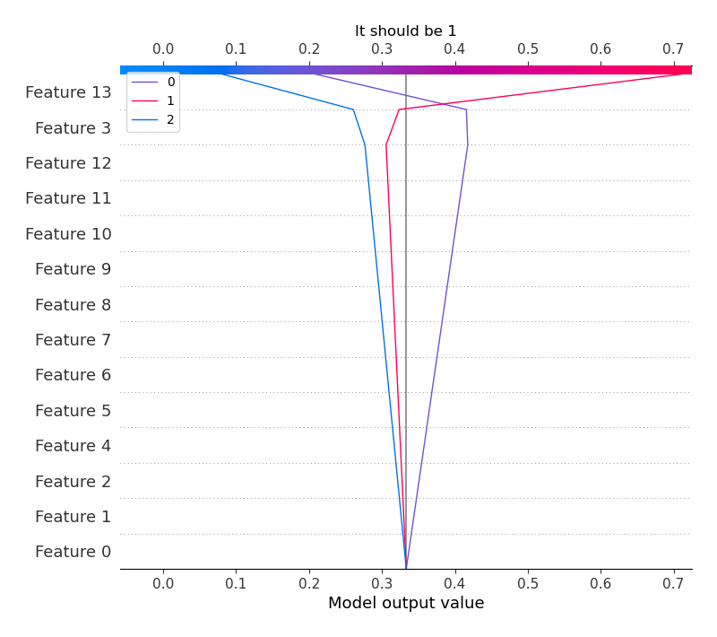
### Best decisions for selected sample 3 (Fold 1)

### Best decisions for selected sample 4 (Fold 1)

[<< Go back](../README.md)
