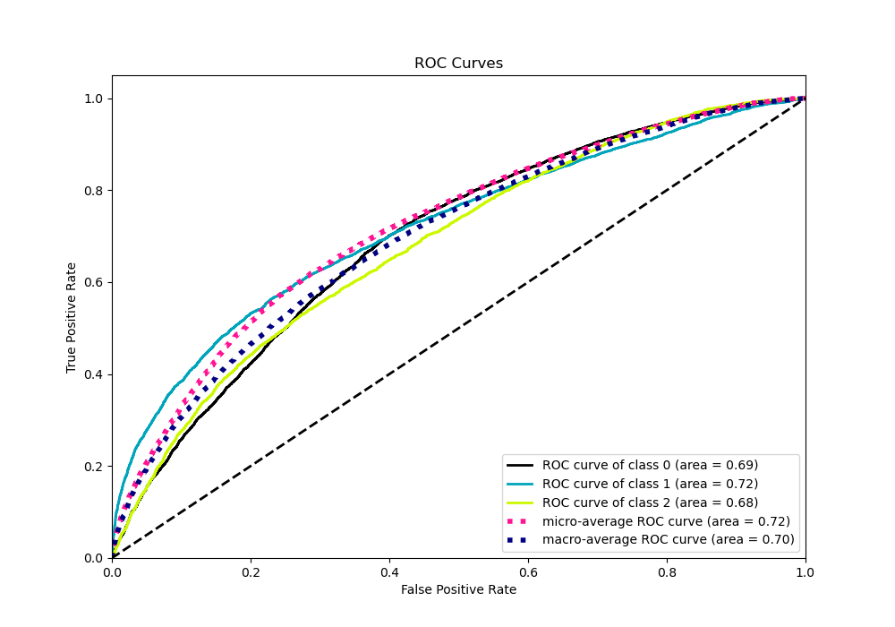

# Summary of 3_Default_Xgboost

[<< Go back](../README.md)

## Extreme Gradient Boosting (Xgboost)
- **n_jobs**: -1
- **objective**: multi:softprob
- **eta**: 0.075
- **max_depth**: 6
- **min_child_weight**: 1
- **subsample**: 1.0
- **colsample_bytree**: 1.0
- **eval_metric**: mlogloss
- **num_class**: 3
- **explain_level**: 2

## Validation
 - **validation_type**: split
 - **train_ratio**: 0.75
 - **shuffle**: True
 - **stratify**: True

## Optimized metric
logloss

## Training time

14.3 seconds

### Metric details
|           |           0 |           1 |           2 |   accuracy |    macro avg |   weighted avg |   logloss |
|:----------|------------:|------------:|------------:|-----------:|-------------:|---------------:|----------:|
| precision |    0.56159  |    0.583268 |    0.470998 |   0.547242 |     0.538619 |       0.543908 |  0.962127 |
| recall    |    0.730653 |    0.437623 |    0.374418 |   0.547242 |     0.514231 |       0.547242 |  0.962127 |
| f1-score  |    0.635063 |    0.500056 |    0.417192 |   0.547242 |     0.517437 |       0.536199 |  0.962127 |
| support   | 7288        | 5082        | 4511        |   0.547242 | 16881        |   16881        |  0.962127 |

## Confusion matrix
|              |   Predicted as 0 |   Predicted as 1 |   Predicted as 2 |
|:-------------|-----------------:|-----------------:|-----------------:|
| Labeled as 0 |             5325 |              866 |             1097 |
| Labeled as 1 |             2058 |             2224 |              800 |
| Labeled as 2 |             2099 |              723 |             1689 |

## Learning curves

## Permutation-based Importance

## Confusion Matrix

## Normalized Confusion Matrix

## ROC Curve

## Precision Recall Curve

## SHAP Importance

## SHAP Dependence plots

### Dependence 0 (Fold 1)

### Dependence 1 (Fold 1)

### Dependence 2 (Fold 1)

## SHAP Decision plots

### Worst decisions for selected sample 1 (Fold 1)

### Worst decisions for selected sample 2 (Fold 1)

### Worst decisions for selected sample 3 (Fold 1)

### Worst decisions for selected sample 4 (Fold 1)

### Best decisions for selected sample 1 (Fold 1)

### Best decisions for selected sample 2 (Fold 1)

### Best decisions for selected sample 3 (Fold 1)

### Best decisions for selected sample 4 (Fold 1)

[<< Go back](../README.md)
