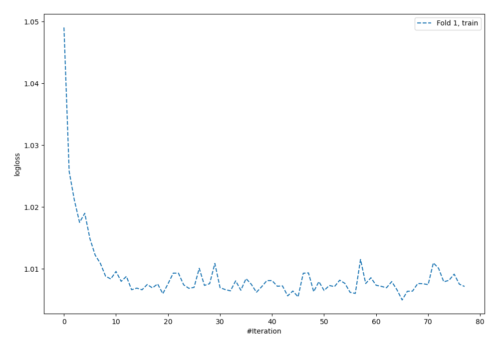
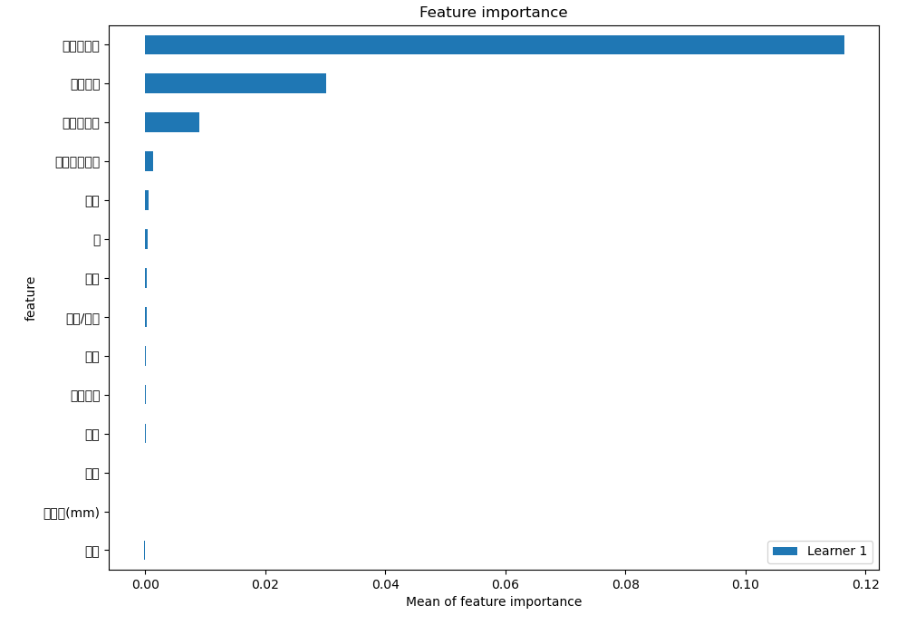
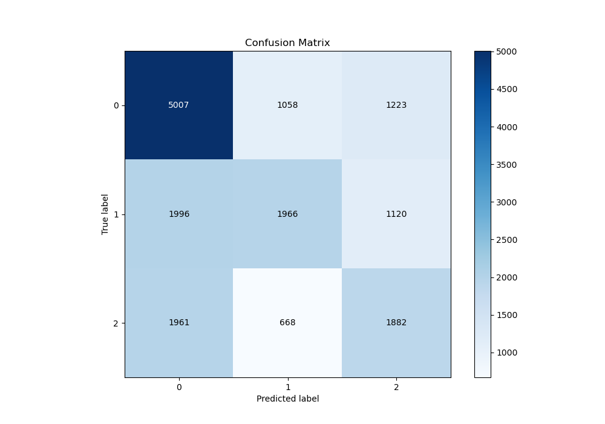
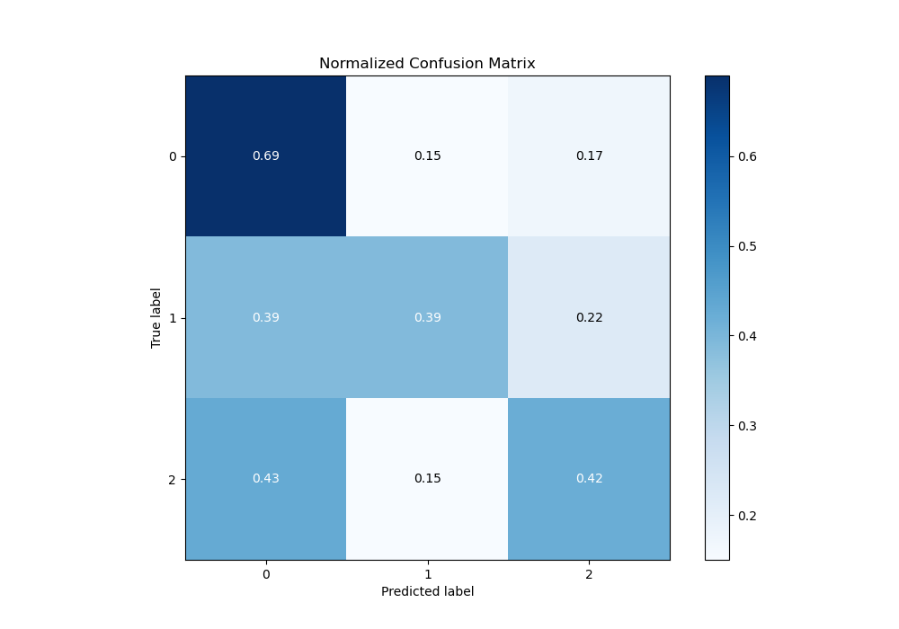
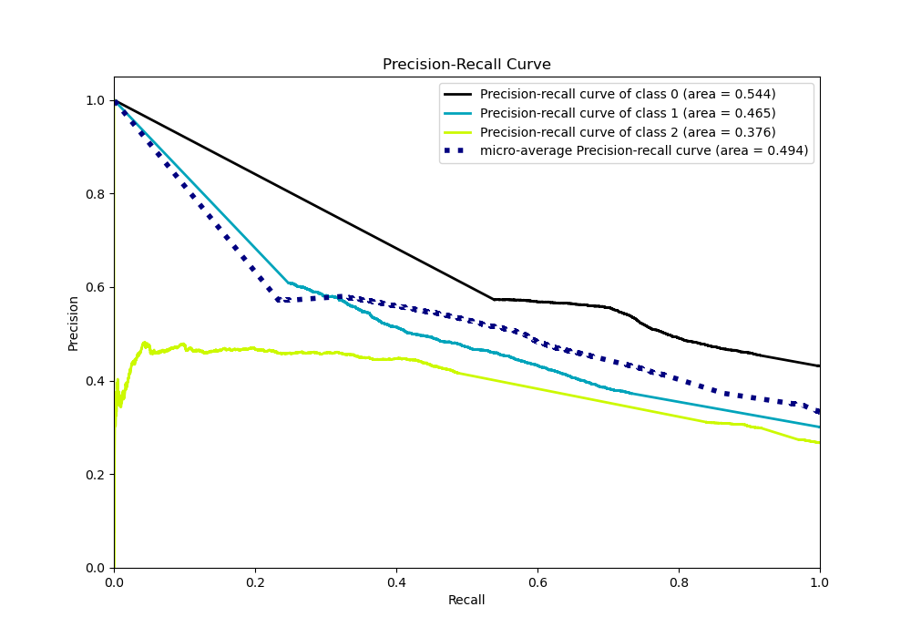

# Summary of 4_Default_NeuralNetwork

[<< Go back](../README.md)

## Neural Network
- **n_jobs**: -1
- **dense_1_size**: 32
- **dense_2_size**: 16
- **learning_rate**: 0.05
- **num_class**: 3
- **explain_level**: 2

## Validation
 - **validation_type**: split
 - **train_ratio**: 0.75
 - **shuffle**: True
 - **stratify**: True

## Optimized metric
logloss

## Training time

12.1 seconds

### Metric details
|           |           0 |           1 |           2 |   accuracy |    macro avg |   weighted avg |   logloss |
|:----------|------------:|------------:|------------:|-----------:|-------------:|---------------:|----------:|
| precision |    0.558568 |    0.532503 |    0.445444 |   0.524554 |     0.512171 |       0.520491 |   1.00866 |
| recall    |    0.68702  |    0.386856 |    0.417202 |   0.524554 |     0.497026 |       0.524554 |   1.00866 |
| f1-score  |    0.61617  |    0.448142 |    0.430861 |   0.524554 |     0.498391 |       0.516067 |   1.00866 |
| support   | 7288        | 5082        | 4511        |   0.524554 | 16881        |   16881        |   1.00866 |

## Confusion matrix
|              |   Predicted as 0 |   Predicted as 1 |   Predicted as 2 |
|:-------------|-----------------:|-----------------:|-----------------:|
| Labeled as 0 |             5007 |             1058 |             1223 |
| Labeled as 1 |             1996 |             1966 |             1120 |
| Labeled as 2 |             1961 |              668 |             1882 |

## Learning curves

## Permutation-based Importance

## Confusion Matrix

## Normalized Confusion Matrix

## ROC Curve

## Precision Recall Curve

[<< Go back](../README.md)
