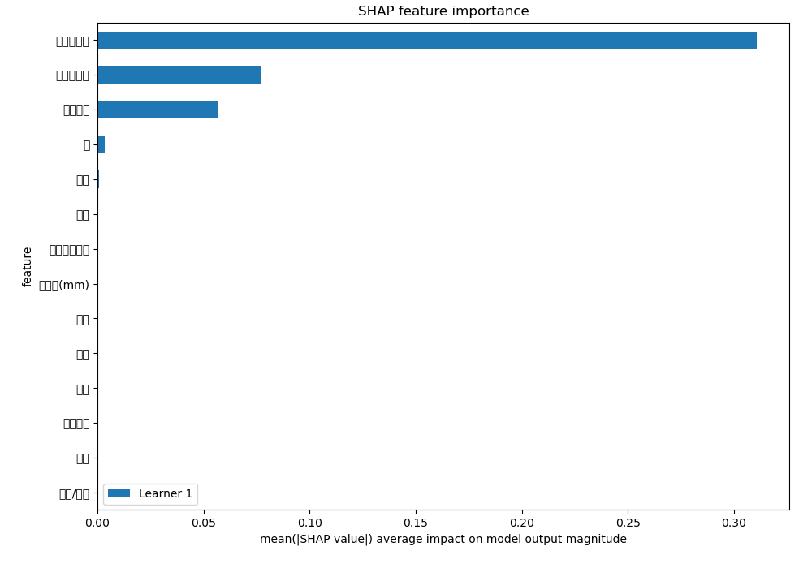

# Summary of 5_Default_RandomForest

[<< Go back](../README.md)

## Random Forest
- **n_jobs**: -1
- **criterion**: gini
- **max_features**: 0.9
- **min_samples_split**: 30
- **max_depth**: 4
- **eval_metric_name**: logloss
- **num_class**: 3
- **explain_level**: 2

## Validation
 - **validation_type**: split
 - **train_ratio**: 0.75
 - **shuffle**: True
 - **stratify**: True

## Optimized metric
logloss

## Training time

8.2 seconds

### Metric details
|           |           0 |           1 |           2 |   accuracy |    macro avg |   weighted avg |   logloss |
|:----------|------------:|------------:|------------:|-----------:|-------------:|---------------:|----------:|
| precision |    0.560225 |    0.547949 |    0.457802 |    0.53735 |     0.521992 |       0.529159 |  0.978571 |
| recall    |    0.739023 |    0.428375 |    0.334294 |    0.53735 |     0.500564 |       0.53735  |  0.978571 |
| f1-score  |    0.637321 |    0.480839 |    0.386419 |    0.53735 |     0.501526 |       0.523166 |  0.978571 |
| support   | 7288        | 5082        | 4511        |    0.53735 | 16881        |   16881        |  0.978571 |

## Confusion matrix
|              |   Predicted as 0 |   Predicted as 1 |   Predicted as 2 |
|:-------------|-----------------:|-----------------:|-----------------:|
| Labeled as 0 |             5386 |              867 |             1035 |
| Labeled as 1 |             2154 |             2177 |              751 |
| Labeled as 2 |             2074 |              929 |             1508 |

## Learning curves

## Permutation-based Importance

## Confusion Matrix

## Normalized Confusion Matrix

## ROC Curve

## Precision Recall Curve

## SHAP Importance

## SHAP Dependence plots

### Dependence 0 (Fold 1)

### Dependence 1 (Fold 1)

### Dependence 2 (Fold 1)

## SHAP Decision plots

### Worst decisions for selected sample 1 (Fold 1)

### Worst decisions for selected sample 2 (Fold 1)

### Worst decisions for selected sample 3 (Fold 1)

### Worst decisions for selected sample 4 (Fold 1)

### Best decisions for selected sample 1 (Fold 1)

### Best decisions for selected sample 2 (Fold 1)

### Best decisions for selected sample 3 (Fold 1)

### Best decisions for selected sample 4 (Fold 1)

[<< Go back](../README.md)
