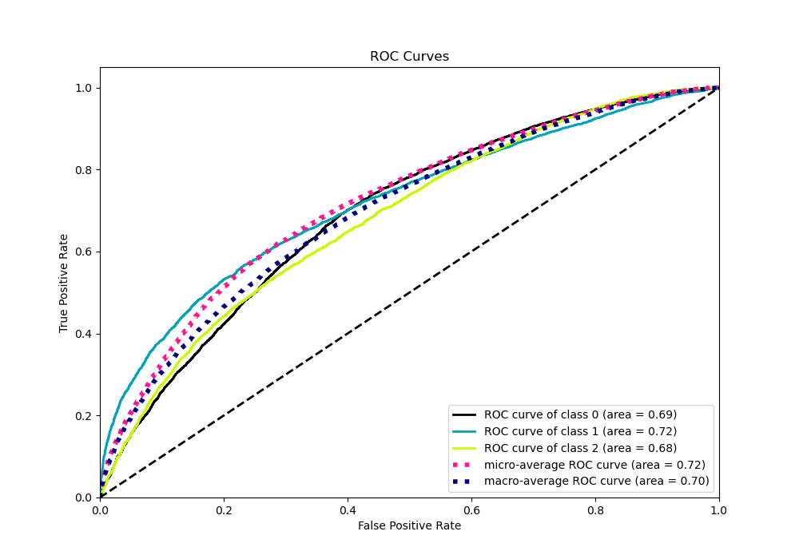
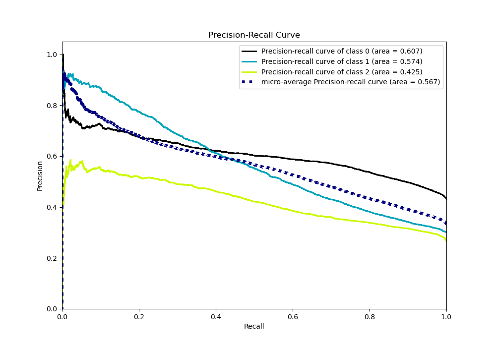

# Summary of Ensemble

[<< Go back](../README.md)

## Ensemble structure
| Model             |   Weight |
|:------------------|---------:|
| 3_Default_Xgboost |        3 |

### Metric details
|           |           0 |           1 |           2 |   accuracy |    macro avg |   weighted avg |   logloss |
|:----------|------------:|------------:|------------:|-----------:|-------------:|---------------:|----------:|
| precision |    0.56159  |    0.583268 |    0.470998 |   0.547242 |     0.538619 |       0.543908 |  0.962127 |
| recall    |    0.730653 |    0.437623 |    0.374418 |   0.547242 |     0.514231 |       0.547242 |  0.962127 |
| f1-score  |    0.635063 |    0.500056 |    0.417192 |   0.547242 |     0.517437 |       0.536199 |  0.962127 |
| support   | 7288        | 5082        | 4511        |   0.547242 | 16881        |   16881        |  0.962127 |

## Confusion matrix
|              |   Predicted as 0 |   Predicted as 1 |   Predicted as 2 |
|:-------------|-----------------:|-----------------:|-----------------:|
| Labeled as 0 |             5325 |              866 |             1097 |
| Labeled as 1 |             2058 |             2224 |              800 |
| Labeled as 2 |             2099 |              723 |             1689 |

## Learning curves

## Confusion Matrix

## Normalized Confusion Matrix

## ROC Curve

## Precision Recall Curve

[<< Go back](../README.md)
